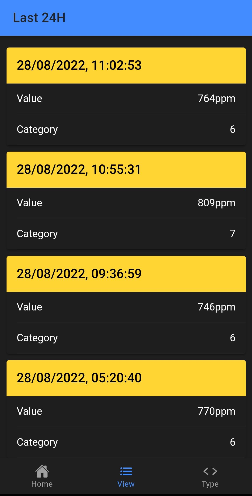

# Table of Contents

- [Table of Contents](#table-of-contents)
- [About](#about)
- [Arduino](#arduino)
- [API](#api)
- [App](#app)

# About

A smart home system with Arduino, InfluxDB, Go, gRPC, and Ionic.

The project consists of 4 main components:
- Data capture from the sensors using Arduino.
- Database for data storage.
- API for storing and retrieving data.
- Mobile app for displaying the values.

<div align="center">
  
  <br/>
  <i>Project infrastructure.</i>
</div>
<br/>

# Arduino
<div align="center">
  
</div>

Arduino is responsible for getting the data from the sensors for the following:
- Carbon monoxide.
- Air quality.
- Raindrops.
- Soil moisture.

After that, it uploads data to the API by calling an appropriate **gRPC** method:
```go
conn, err := grpc.Dial("address", grpc.WithTransportCredentials(tlsCred))
client := pb.NewRequestClient(conn)

client.Add(context.Background(), &pb.Data{
    DataType:  pb.DataType(dataType),
    Value:     value,
    Timestamp: timestamppb.New(time.Now()),
})
```
<br/>

<div align="center">
  
  <br/>
  <i>Sensors schematic.</i>
</div>
<br/>

More circuit design images can be seen [here](/images/circuit-designs/).

# API
<div align="center">
  
  
  
  
  
  
  
</div>

The API was made with the language **Go**, **gRPC** framework and is hosted by **AWS EC2**. For the database, we chose **InfluxDB**, which is hosted by the **InfluxDB Cloud**.

Since we have 2 servers for API hosting, we also added **AWS ELB** for distributing network traffic.

Data is stored in a single bucket with four different measurements:
- CARBON_MONOXIDE.
- AIR_QUALITY.
- RAINDROPS.
- SOIL_MOISTURE.

Each measurement has three fields: *value*, i.e. the sensor's recorded value; *_time*, i.e. when the *value* was taken; and *category*, with it being in the following range:
- For CARBON_MONOXIDE it is [1, 7], with 1 being the best.
- For AIR_QUALITY it is [1, 6], with 1 being the best.
- For RAINDROPS it is [1, 4], with 1 indicating no or little rain.
- For SOIL_MOISTURE it is [0, 100]%, with 0 indicating no soil moisture.

To speed up queries, we used **Redis** as an in-memory cache, which stores the latest added data and is hosted by **Amazon ElastiCache**.

We also added support for unit testing, with the appropriate files having the *_test.go* suffix.

Lastly, we added support for mutual TLS with the help of **OpenSSL**.

The gRPC service (*.proto* file) can be seen [here](/api/schema/).

```go
func (server *Server) Latest(_ context.Context, request *pb.DataRequest) 
(*pb.DataWithCategory, error) {
	if request == nil {
		return nil, status.Error(codes.InvalidArgument, "request can't be nil")
	}

	var latest *model.DataResponse
	var ok = false

	if server.cache != nil {
		value, err := server.cache.Get(request.DataType.String())

		if err != nil && server.Development {
			log.Printf("Error with cache get, error: %v", err)
		} else {
			if err := json.Unmarshal([]byte(value), &latest); 
			err != nil && server.Development {
				log.Printf("Error with json.Unmarshal, error: %v", err)
			} else if err != redis.Nil && value != "" {
				ok = true
			}
		}
	}

	if !ok {
		var err error

		latest, err = server.DBService.Latest(request.GetDataType().String())
		if err != nil {
			return nil, status.Error(codes.NotFound, err.Error())
		}

		if err = server.AddToCache(latest); err != nil && server.Development {
			log.Printf("Error with cache set, error: %v", err)
		}
	}

	return latest.Convert(), nil
}
```
<p align="center">
  <i>Method to get the latest record.</i>
</p>

# App
<div align="center">
  
   
  
</div>

The mobile app was made with Ionic, React, and TypeScript. The main app functionality is getting data from the API and displaying it.

The app features the latest, median, maximum, minimum, and all today's values.

<div align="center">
  
  
</div>

<div align="center">
  
  
</div>
